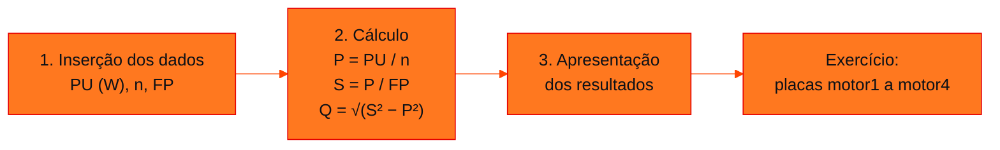

<!-- Documentação acadêmica da aula. Padrão visual: Knowledge Atelier (github.com/RenanMano). -->
<p align="center">
  
</p>
<p align="center">
  
</p>
<p align="center"><a href="#visao-geral">Visão geral</a> &nbsp;·&nbsp; <a href="#fundamentacao-teorica">Teoria</a> &nbsp;·&nbsp; <a href="#exemplos-praticos">Exemplos</a> &nbsp;·&nbsp; <a href="#exercicios-resolvidos">Exercícios</a> &nbsp;·&nbsp; <a href="#aplicacoes">Mercado</a> &nbsp;·&nbsp; <a href="#resumo">Resumo</a> &nbsp;·&nbsp; <a href="#questoes">Questões</a> &nbsp;·&nbsp; <a href="#referencias">Referências</a></p>
<p align="center">
  
  
  
  
  
  
</p>
<p align="center">
  
</p>
<br />

<h2 id="identificacao">Identificação da aula</h2>

| Item | Descrição |
| :--- | :--- |
| Disciplina | [Soluções em Energias Renováveis e Sustentáveis](../README.md) |
| Aula | 03 — 16/03/2026 |
| Título | Atividade: Potências de Motores a partir dos Dados de Placa |
| Tema central | Notebook que lê potência útil, rendimento e fator de potência de um motor de indução e calcula as potências ativa (P = PU / η), aparente (S = P / FP) e reativa (Q pelo teorema de Pitágoras); exercício com quatro placas reais (WEG W22 Premium, WEG Alto Rendimento Plus, Siemens 1LA9 e WEG W40 Premium) e conferência dos resultados com a corrente de placa. |
| Tecnologias e ferramentas | Python 3 (Google Colab) |
| Natureza do conteúdo | Aula prática (notebook e imagens de placas) |

### Materiais da pasta

| Arquivo | Conteúdo |
| :--- | :--- |
| [`Aula_02_SERS.ipynb`](Aula_02_SERS.ipynb) | Notebook “Atividade - Motores - SERS”: objetivo, entrada de PU, rendimento e FP com input() (exemplo salvo com 3000 W, 0,76 e 0,80), cálculo de P, S e Q, impressão dos resultados (3947 W, 4934 VA e 2960 VAr) e o exercício de calcular as potências das placas da pasta. |
| [`Energia,_Potência,_Consumo_e_Demanda.pdf`](Energia%2C_Pot%C3%AAncia%2C_Consumo_e_Demanda.pdf) | Slides “Energia, Potência, Consumo e Demanda” (15 páginas), idênticos (mesmo hash MD5) aos da aula 04, onde estão documentados. |
| [`motor1.png`](motor1.png) | Placa de motor WEG W22 Premium: 0,75 kW (1,0 cv), carcaça 80, 220/380 V, 2,89/1,67 A, 1725 rpm, 60 Hz, FS 1,25, Ip/In 7,3, FP 0,82, rendimento 83,0%, IP55, regime S1. |
| [`motor2.png`](motor2.png) | Placa de motor WEG Alto Rendimento Plus, carcaça 132S: 7,5 kW (10 cv), 220/380/440 V, 26,4/15,3/13,2 A, 1760 rpm, 60 Hz, FS 1,15, Ip/In 7,8, rendimento 91,0%, cos φ 0,82, IP55, regime S1. |
| [`motor3_rend_0_85.jpg`](motor3_rend_0_85.jpg) | Fotografia de placa de motor Siemens 1LA9, carcaça 132S: a 50 Hz, 11 kW, 400/690 V, 20,5/11,8 A, cos φ 0,88 e 2930 rpm; a 60 Hz, 12,6 kW, 460 V, 20 A, cos φ 0,89 e 3530 rpm. A placa não traz rendimento; o nome do arquivo indica 0,85. |
| [`motor4.jpg`](motor4.jpg) | Imagem de placa de motor WEG W40 Premium: 300 kW (400 cv), carcaça 280L, 380/660 V, 535/308 A, 3565 rpm, 60 Hz, FS 1,15, FP 0,89, rendimento 95,8%, Ip/In 6,0, IP23. |

> [!NOTE]
> **Limitações da documentação.** O notebook (11 células) foi lido com as saídas salvas; ele usa input(), por isso a mesma lógica foi reescrita como função para ser executada e verificada sem digitação. O PDF desta pasta é idêntico (mesmo hash MD5) ao da aula 04 e está documentado naquela página. As quatro imagens foram lidas visualmente. A placa Siemens (motor3) não informa rendimento: o valor 0,85 vem do nome do arquivo. O notebook deixa o exercício em branco, então as respostas são propostas para estudo.

<br />

<h2 id="visao-geral">Visão geral</h2>

A aula transforma as fórmulas de potência em um pequeno programa. O *notebook* `Aula_02_SERS.ipynb`, cujo título é "Atividade - Motores - SERS", tem um objetivo direto: **com base nos dados de placa de motores de indução (PU, n, FP), calcular as potências ativa, reativa e aparente (P, Q e S)**.

O *notebook* foi executado com os dados da placa WEG W22 de 3 kW, estudada na [aula 02](../aula02-09-03-26/README.md). No final, propõe o exercício com as quatro placas da pasta, que vão de 0,75 kW a 300 kW.



*Figura 1 — As três etapas do notebook e o exercício final.*

<br />

<h2 id="objetivos">Objetivos de aprendizagem</h2>

- Calcular P, S e Q a partir de potência útil, rendimento e fator de potência.
- Implementar o cálculo em Python, com entrada, processamento e saída.
- Extrair os dados necessários de placas reais, de fabricantes e formatos diferentes.
- Conferir os resultados com a corrente de placa, por $S = \sqrt{3}\,V I$.
- Comparar o rendimento e o fator de potência de motores de portes diferentes.

<br />

<h2 id="pre-requisitos">Pré-requisitos</h2>

- Leitura de placa de motor, da [aula 02](../aula02-09-03-26/README.md).
- Potências, fator de potência e rendimento: os slides estão nesta pasta, e a explicação completa, na página da [aula 04](../aula04-19-03-26/README.md).
- Python: `input`, `int`, `float`, operadores `**` e *f-strings*.

<br />

<h2 id="fundamentacao-teorica">Fundamentação teórica</h2>

### 1. As três fórmulas do notebook

| Etapa | Fórmula | No código |
| :--- | :--- | :--- |
| Potência ativa (absorvida da rede) | $P = \dfrac{P_U}{\eta}$ | `P = PU / n` |
| Potência aparente | $S = \dfrac{P}{\text{FP}}$ | `S = P / FP` |
| Potência reativa (teorema de Pitágoras) | $Q = \sqrt{S^2 - P^2}$ | `Q = (S**2 - P**2)**0.5` |

O *notebook* lembra que `**` é a exponenciação em Python e que `** 0.5` é a raiz quadrada. A potência útil $P_U$ é a potência **mecânica** da placa, em watts; o rendimento $n$ e o fator de potência $\text{FP} = \cos\varphi$ são números entre 0 e 1.

### 2. Execução registrada

Com $P_U = 3000$ W, $n = 0{,}76$ e $\text{FP} = 0{,}80$, os dados da placa WEG W22, o *notebook* imprimiu:

<!-- norun -->
```text
A potência ativa será de 3947 W
A potência aparente será de 4934 VA
A potência reativa será de 2960 VAr
```

As células intermediárias mostram os valores sem arredondamento: `(3947.37, 4934.21, 2960.53)`. O `int()` da impressão **trunca**, por isso a reativa aparece como 2960, e não 2961. O próprio *notebook* comenta a alternativa `f'{P:.2f}'` para duas casas decimais.

### 3. Conferência pela corrente de placa

Num motor trifásico, a potência aparente também vale $S = \sqrt{3}\,V I$, com a tensão e a corrente de **uma mesma** ligação da placa. Se o cálculo $P_U / \eta / \text{FP}$ chegar perto desse valor, os dados lidos estão coerentes.

<br />

<h2 id="exemplos-praticos">Exemplos práticos</h2>

### Exemplo aplicado — o exercício com as quatro placas

**Solução proposta para estudo.** A função tem a mesma lógica do *notebook*, sem `input()`. Os dados foram lidos das imagens da pasta; para o motor Siemens, que não informa rendimento, usa-se o valor 0,85 do nome do arquivo e os dados de 50 Hz.

```python
# Exercício da Atividade - Motores (16/03): P, S e Q das placas da pasta (solução proposta para estudo)
from math import sqrt

def potencias(PU, n, FP):
    """Mesma lógica do notebook Aula_02_SERS.ipynb, sem input(): PU em W, n e FP entre 0 e 1."""
    P = PU / n
    S = P / FP
    Q = (S ** 2 - P ** 2) ** 0.5
    return P, S, Q

# (placa, PU em W, rendimento, FP, tensão de referência em V, corrente de placa em A)
placas = [
    ("motor1 WEG W22 Premium 0,75 kW", 750, 0.830, 0.82, 220, 2.89),
    ("motor2 WEG Alto Rendimento Plus 7,5 kW", 7500, 0.910, 0.82, 220, 26.4),
    ("motor3 Siemens 11 kW (50 Hz)", 11000, 0.85, 0.88, 400, 20.5),
    ("motor4 WEG W40 Premium 300 kW", 300000, 0.958, 0.89, 380, 535),
]
print(f"{'placa':40} {'P (W)':>10} {'S (VA)':>10} {'Q (VAr)':>10} {'√3·V·I (VA)':>12}")
for nome, PU, n, FP, V, I in placas:
    P, S, Q = potencias(PU, n, FP)
    print(f"{nome:40} {P:10.0f} {S:10.0f} {Q:10.0f} {sqrt(3) * V * I:12.0f}")

# Exemplo do próprio notebook (placa WEG W22 de 3 kW): saída registrada 3947 W, 4934 VA e 2960 VAr
P, S, Q = potencias(3000, 0.76, 0.80)
print(f"Notebook: P = {int(P)} W, S = {int(S)} VA, Q = {int(Q)} VAr")
```

Saída esperada:

```text
placa                                         P (W)     S (VA)    Q (VAr)  √3·V·I (VA)
motor1 WEG W22 Premium 0,75 kW                  904       1102        631         1101
motor2 WEG Alto Rendimento Plus 7,5 kW         8242      10051       5753        10060
motor3 Siemens 11 kW (50 Hz)                  12941      14706       6985        14203
motor4 WEG W40 Premium 300 kW                313152     351857     160433       352126
Notebook: P = 3947 W, S = 4934 VA, Q = 2960 VAr
```

**Leitura dos resultados:**

- Nas três placas WEG, $S$ calculado e $\sqrt{3}\,V I$ diferem menos de 0,2%: os dados de placa são coerentes entre si.
- No motor Siemens, o cálculo com $\eta = 0{,}85$ dá 14.706 VA, contra 14.203 VA pela corrente. Isolando o rendimento, $\eta = \frac{11\,000}{14\,203 \times 0{,}88} \approx 0{,}88$. O valor 0,85 do nome do arquivo é, portanto, uma estimativa conservadora para o exercício.
- O rendimento cresce com o porte e com a linha do motor: 76% no W22 de 3 kW da [aula 02](../aula02-09-03-26/README.md), 83% no W22 Premium de 0,75 kW, 91% no Alto Rendimento Plus e 95,8% no W40 Premium de 300 kW. No motor de 300 kW, as perdas são de cerca de 13 kW, mas representam só 4,2% da potência absorvida.

<br />

<h2 id="exercicios-resolvidos">Exercícios e resoluções comentadas</h2>

### Exercício do notebook — calcular as potências das placas

O enunciado está na última célula do *notebook*: "acesse as imagens das placas disponíveis na pasta da Aula 02 (16/03) e calcule as potências". A célula de resposta está vazia; a resolução está no exemplo aplicado acima, como **solução proposta para estudo**.

### Exercícios propostos para estudo

1. Calcule P, S e Q do motor Siemens na condição de 60 Hz (12,6 kW, cos φ 0,89), com rendimento 0,85.
2. O motor2 tem três tensões na placa. A potência aparente depende da tensão escolhida? Confira com 440 V e 13,2 A.
3. O que aconteceria no *notebook* se o usuário digitasse `0.75` como potência útil (em kW)?

<details>
<summary><strong>Solução proposta para estudo</strong></summary>

1. $P = 12\,600 / 0{,}85 \approx 14\,824$ W; $S = 14\,824 / 0{,}89 \approx 16\,656$ VA; $Q = \sqrt{16\,656^2 - 14\,824^2} \approx 7\,594$ VAr.
2. Não. $\sqrt{3} \times 440 \times 13{,}2 \approx 10\,060$ VA, praticamente o mesmo valor obtido com 220 V e 26,4 A. A tensão escolhida muda a corrente, e não a potência.
3. `int(input(...))` não aceita `0.75` e o programa pararia com `ValueError`. Além disso, a unidade esperada é watt: o valor correto seria `750`. Usar `float()` e deixar a unidade explícita na pergunta evita os dois problemas.

</details>

<br />

<h2 id="aplicacoes">Aplicações no mercado de trabalho</h2>

- **Diagnóstico energético:** levantar as placas dos motores de uma planta e calcular P, S e Q é o primeiro passo para estimar consumo e reativo.
- **Correção do fator de potência:** a soma das potências reativas dos motores orienta o dimensionamento de bancos de capacitores.
- **Troca por motores de alto rendimento:** comparar perdas de placa sustenta a análise de retorno do investimento.
- **Automação de cálculos:** pequenos *scripts* como o do *notebook* viram ferramentas internas de engenharia e manutenção.

<br />

<h2 id="boas-praticas">Boas práticas e erros comuns</h2>

| Problemático | Recomendado | Motivo |
| :--- | :--- | :--- |
| `int(input(...))` para a potência | `float(input(...))` | Aceita valores com casas decimais |
| Truncar com `int()` na saída | Arredondar com `round()` ou formatar com `:.2f` | `int(2960.53)` mostra 2960, e não 2961 |
| Misturar kW e W | Converter tudo para a mesma unidade antes do cálculo | Evita erros de mil vezes |
| Usar a tensão de uma ligação com a corrente de outra | Usar o par V e I da mesma ligação | Só assim $\sqrt{3}\,V I$ dá a potência aparente correta |
| Aceitar um rendimento sem conferir | Comparar $P_U / \eta / \text{FP}$ com $\sqrt{3}\,V I$ | Revela dados inconsistentes, como no motor Siemens |

<br />

<h2 id="resumo">Resumo para revisão</h2>

- $P = P_U / \eta$; $S = P / \text{FP}$; $Q = \sqrt{S^2 - P^2}$.
- O *notebook* lê PU, n e FP com `input()` e imprime P, S e Q; com a placa de 3 kW: 3947 W, 4934 VA e 2960 VAr.
- $S = \sqrt{3}\,V I$ confere a coerência dos dados de placa.
- Motores maiores e de linhas premium têm rendimentos maiores: de 76% a 95,8% nas placas estudadas.

<br />

<h2 id="questoes">Questões de fixação</h2>

1. Por que a potência ativa é maior do que a potência útil da placa?
2. Qual fórmula do *notebook* usa o teorema de Pitágoras?
3. Um motor tem $S = 10$ kVA e $P = 8$ kW. Qual é o fator de potência e qual é $Q$?
4. Por que o rendimento do motor Siemens foi questionado na análise?

<details>
<summary><strong>Respostas comentadas</strong></summary>

1. Porque o motor tem perdas: a potência absorvida da rede é a útil dividida pelo rendimento, que é menor do que 1.
2. A da potência reativa: $Q = \sqrt{S^2 - P^2}$, já que P, Q e S formam um triângulo retângulo.
3. $\text{FP} = 8/10 = 0{,}8$ e $Q = \sqrt{100 - 64} = 6$ kVAr.
4. Porque, com 0,85, a potência aparente calculada (14.706 VA) fica 3,5% acima da obtida pela corrente de placa (14.203 VA); a corrente indica um rendimento de cerca de 0,88.

</details>

<br />

<h2 id="referencias">Referências e materiais complementares</h2>

- [Python — `float`](https://docs.python.org/pt-br/3/library/functions.html#float) · [`round`](https://docs.python.org/pt-br/3/library/functions.html#round)
- Teoria completa: [aula 04](../aula04-19-03-26/README.md) · placa de 3 kW: [aula 02](../aula02-09-03-26/README.md)
- Materiais da pasta: [notebook](Aula_02_SERS.ipynb) · [slides](Energia%2C_Pot%C3%AAncia%2C_Consumo_e_Demanda.pdf) · placas [motor1](motor1.png), [motor2](motor2.png), [motor3](motor3_rend_0_85.jpg) e [motor4](motor4.jpg)

<br />

<p align="center"><a href="../aula02-09-03-26/README.md">← Aula anterior</a> &nbsp;·&nbsp; <a href="../README.md">Índice da disciplina</a> &nbsp;·&nbsp; <a href="../aula04-19-03-26/README.md">Próxima aula →</a></p>

<p align="center"></p>
