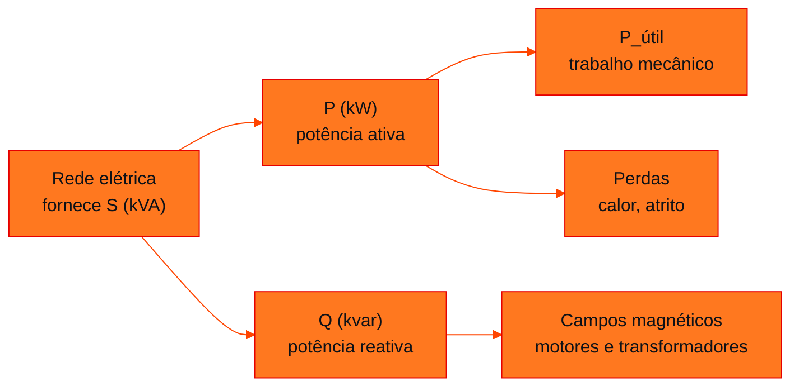
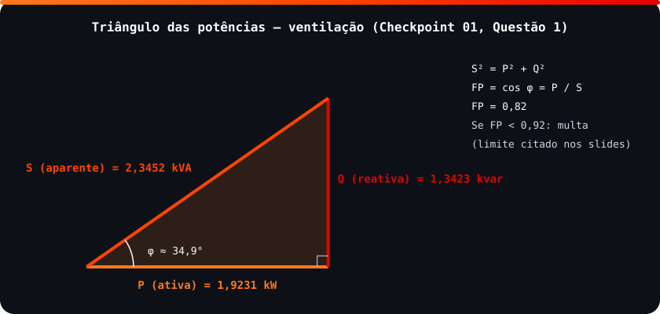

<!-- Documentação acadêmica da aula. Padrão visual: Knowledge Atelier (github.com/RenanMano). -->
<p align="center">
  
</p>
<p align="center">
  
</p>
<p align="center"><a href="#visao-geral">Visão geral</a> &nbsp;·&nbsp; <a href="#fundamentacao-teorica">Teoria</a> &nbsp;·&nbsp; <a href="#exemplos-praticos">Exemplos</a> &nbsp;·&nbsp; <a href="#exercicios-resolvidos">Exercícios</a> &nbsp;·&nbsp; <a href="#aplicacoes">Mercado</a> &nbsp;·&nbsp; <a href="#resumo">Resumo</a> &nbsp;·&nbsp; <a href="#questoes">Questões</a> &nbsp;·&nbsp; <a href="#referencias">Referências</a></p>
<p align="center">
  
  
  
  
  
  
</p>
<p align="center">
  
</p>
<br />

<h2 id="identificacao">Identificação da aula</h2>

| Item | Descrição |
| :--- | :--- |
| Disciplina | [Soluções em Energias Renováveis e Sustentáveis](../README.md) |
| Aula | 04 — 19/03/2026 |
| Título | Energia, Potência, Consumo e Demanda |
| Tema central | Conceitos fundamentais e comerciais de energia elétrica: energia e consumo (kWh), potência e demanda (contratada e medida), tensão, corrente e Lei de Joule, potências ativa, reativa e aparente, triângulo das potências, fator de potência, rendimento de motores, carga indutiva, impacto do reativo alto e cálculo em Python. |
| Tecnologias e ferramentas | Conceitual (slides); Python 3 (exemplo do material) |
| Natureza do conteúdo | Aula expositiva com prática em Python |

### Materiais da pasta

| Arquivo | Conteúdo |
| :--- | :--- |
| [`Energia,_Potência,_Consumo_e_Demanda.pdf`](Energia%2C_Pot%C3%AAncia%2C_Consumo_e_Demanda.pdf) | Slides (15 páginas): energia e consumo, potência e demanda, Lei de Joule, por que três potências, potências S, P e Q, triângulo das potências, rendimento de motores, impacto do reativo alto, carga indutiva, o motor elétrico, Python básico, exemplo do motor trifásico e referências. |
| [`assets/triangulo-potencias.svg`](assets/triangulo-potencias.svg) | Figura original desta documentação: triângulo das potências com os valores da Questão 1 do Checkpoint 01 (P = 1,9231 kW, Q = 1,3423 kvar, S = 2,3452 kVA, FP = 0,82). |

> [!NOTE]
> **Limitações da documentação.** O PDF (15 páginas) foi lido integralmente. O exemplo em Python do slide usa input(); nesta página, a mesma lógica foi reorganizada como função, para ser executada e verificada sem digitação. Os links de referência do material apontam para sites comerciais e institucionais e são reproduzidos como estão, sem verificação de disponibilidade. O mesmo PDF está, idêntico, na pasta da aula 03, usado na atividade de cálculo com placas de motores.

<br />

<h2 id="visao-geral">Visão geral</h2>

A aula de abertura dá o vocabulário elétrico para falar de **eficiência energética**, o tema da disciplina, e se organiza em duas camadas:

- **conceitos físicos:** energia, potência, tensão, corrente e calor;
- **conceitos comerciais:** consumo em kWh, demanda contratada e medida e multas por fator de potência baixo.

O fio condutor é o **motor elétrico**. Segundo o slide, com dados do PROCEL/Eletrobras, ele responde por **68% da energia elétrica consumida nas indústrias brasileiras**. Por isso, qualquer ganho de eficiência em motores gera grande economia.



*Figura 1 — Para onde vai a potência entregue a um motor.*

<br />

<h2 id="objetivos">Objetivos de aprendizagem</h2>

- Distinguir energia (kWh) de potência (kW) e demanda contratada de demanda medida.
- Calcular as potências ativa, reativa e aparente e relacioná-las no triângulo das potências.
- Interpretar o fator de potência e as consequências de um reativo alto.
- Calcular o rendimento de um motor e a potência que ele absorve da rede.
- Implementar esses cálculos em Python.

<br />

<h2 id="pre-requisitos">Pré-requisitos</h2>

- Trigonometria básica (seno, cosseno e teorema de Pitágoras).
- Python básico, também revisado na própria aula: `input`, `int`, `float`, `print` e *f-strings*.

<br />

<h2 id="fundamentacao-teorica">Fundamentação teórica</h2>

### 1. Energia, consumo, potência e demanda

| Conceito | Definição (slides) | Unidade |
| :--- | :--- | :--- |
| **Energia** | Capacidade de realizar trabalho: a potência usada durante um tempo, $E = P \times \Delta t$ | kWh ou J |
| **Consumo** (comercial) | Energia acumulada medida pela concessionária | kWh |
| **Potência** | Taxa de transferência de energia | W ou kW |
| **Demanda contratada** | Potência máxima que o cliente se compromete a usar, definida em contrato | kW |
| **Demanda medida** | Potência real consumida, medida pela concessionária a cada 15 minutos | kW |

Em corrente contínua, $P = U \times I$; em corrente alternada, $P = U \times I \times \cos\varphi$.

### 2. Tensão, corrente e Lei de Joule

- **Tensão (U, em volts):** diferença de potencial, a "força" que move os elétrons.
- **Corrente (I, em ampères):** quantidade de carga que passa por segundo.
- **Lei de Joule:** a energia elétrica vira calor nas resistências, segundo $Q_{\text{calor}} = I^2 \times R \times \Delta t$, em joules.

### 3. As três potências em corrente alternada

| Potência | Fórmula | Unidade | Papel |
| :--- | :--- | :--- | :--- |
| **Ativa (P)** | $U \cdot I \cdot \cos\varphi$ | W | Realiza trabalho útil: calor, luz e movimento |
| **Reativa (Q)** | $U \cdot I \cdot \operatorname{sen}\varphi$ | VAr | Cria campos magnéticos; necessária, mas não produz trabalho |
| **Aparente (S)** | $U \cdot I$ | VA | Total fornecido pela rede; soma vetorial de P e Q |

<p align="center">
  
</p>

*Figura 2 — Triângulo das potências: $S^2 = P^2 + Q^2$ e $\text{FP} = \cos\varphi = P/S$. Os valores são os da Questão 1 do [Checkpoint 01](../aula05-29-03-26/README.md).*

### 4. Fator de potência e reativo alto

O **fator de potência** mede a eficiência da conversão: quanto do total fornecido (S) vira potência ativa (P). Os slides apontam quatro impactos de um reativo alto:

- **multa:** se FP < 0,92, a concessionária cobra o excedente de reativo, limite atribuído no material à Resolução ANEEL nº 414;
- **corrente maior** na rede, ocupando a capacidade de cabos e transformadores;
- **ocupação da infraestrutura**, que impede a ligação de novas máquinas;
- **quedas de tensão**, que prejudicam equipamentos sensíveis.

As **cargas indutivas** (motores, transformadores e bobinas) são a causa: precisam de campos magnéticos para funcionar. A **solução** é corrigir o fator de potência, tipicamente com capacitores, como na Questão 1 do Checkpoint 01. Isso reduz a corrente reativa.

### 5. Rendimento de motores

$$\eta = \frac{P_{\text{útil}}}{P} \qquad\Longrightarrow\qquad P = \frac{P_{\text{útil}}}{\eta}$$

A potência ativa absorvida já inclui as **perdas**. Exemplo do slide: um motor que recebe 1000 W e entrega 900 W úteis tem rendimento de 90%.

<br />

<h2 id="exemplos-praticos">Exemplos práticos</h2>

### Exemplo básico — o cálculo do motor trifásico do slide

O slide lê potência útil, rendimento e fator de potência com `input()` e calcula P, S e Q. A mesma sequência de fórmulas, organizada como função:

```python
# Exemplo do slide "Motor trifásico", reorganizado como função (sem input) para ser testável
def potencias_motor(potencia_util, rendimento_pct, fator_potencia):
    potencia_ativa = potencia_util / (rendimento_pct / 100)          # P = P_útil / η
    potencia_aparente = potencia_ativa / fator_potencia               # S = P / FP
    potencia_reativa = (potencia_aparente ** 2 - potencia_ativa ** 2) ** 0.5   # Q = √(S² − P²)
    return potencia_ativa, potencia_aparente, potencia_reativa

for util, eta, fp in [(1.5, 78, 0.82), (1.5, 78, 0.96)]:
    P, S, Q = potencias_motor(util, eta, fp)
    print(f"P_útil={util} kW, η={eta}%, FP={fp}:")
    print(f"  P (Ativa): {P:.2f} kW | Q (Reativa): {Q:.2f} kVAr | S (Aparente): {S:.2f} kVA")

# Energia: E = P × Δt (8 h por dia, 22 dias)
P, _, _ = potencias_motor(1.5, 78, 0.82)
print(f"Consumo mensal: {P * 8 * 22:.1f} kWh")
```

Saída esperada:

```text
P_útil=1.5 kW, η=78%, FP=0.82:
  P (Ativa): 1.92 kW | Q (Reativa): 1.34 kVAr | S (Aparente): 2.35 kVA
P_útil=1.5 kW, η=78%, FP=0.96:
  P (Ativa): 1.92 kW | Q (Reativa): 0.56 kVAr | S (Aparente): 2.00 kVA
Consumo mensal: 338.5 kWh
```

- A **potência ativa não muda** (1,92 kW) quando o fator de potência passa de 0,82 para 0,96. O motor e o trabalho são os mesmos.
- O que cai é a potência **reativa** (1,34 → 0,56 kVAr) e, com ela, a **aparente** (2,35 → 2,00 kVA), que é o que a rede precisa fornecer.
- Para reduzir o **consumo** em kWh, é preciso melhorar o **rendimento**.

### Exemplo aplicado — leitura comercial

Com 8 h por dia e 22 dias, o motor consome cerca de 338,5 kWh por mês, que é a grandeza cobrada como **consumo**. Os 1,92 kW contam para a **demanda**, medida a cada 15 minutos. Corrigir o FP para 0,96, acima de 0,92, elimina a multa por excedente de reativo sem alterar esse consumo.

<br />

<h2 id="exercicios-resolvidos">Exercícios e resoluções comentadas</h2>

Os exercícios avaliativos desta etapa estão no **Checkpoint 01**, cujo gabarito detalhado está na [aula 05](../aula05-29-03-26/README.md). **Exercício proposto para estudo:** um motor entrega 4 kW úteis com rendimento de 80% e FP de 0,8. Calcule P, S e Q e diga se haveria multa.

<details>
<summary><strong>Solução proposta para estudo</strong></summary>

- $P = 4 / 0{,}8 = 5$ kW;
- $S = 5 / 0{,}8 = 6{,}25$ kVA;
- $Q = \sqrt{6{,}25^2 - 5^2} = \sqrt{39{,}0625 - 25} = 3{,}75$ kvar.

Com FP = 0,8 < 0,92, **haveria multa** por excedente de reativo, segundo o limite citado nos slides. Com `potencias_motor(4, 80, 0.8)`, a função do exemplo devolve os mesmos valores.

</details>

<br />

<h2 id="aplicacoes">Aplicações no mercado de trabalho</h2>

- **Gestão de energia industrial:** monitorar o fator de potência e dimensionar bancos de capacitores evita multas.
- **Eficiência energética:** trocar motores por modelos de maior rendimento reduz o consumo, a ação de maior impacto segundo o dado do PROCEL.
- **Software para energia:** medidores inteligentes e painéis calculam P, Q, S e FP em tempo real, a mesma lógica do exemplo.

<br />

<h2 id="boas-praticas">Boas práticas e erros comuns</h2>

| Problemático | Recomendado | Motivo |
| :--- | :--- | :--- |
| Confundir kW (potência) e kWh (energia) | Energia = potência × tempo | Grandezas e cobranças diferentes |
| Somar P e Q aritmeticamente | $S = \sqrt{P^2 + Q^2}$ | A soma é vetorial |
| Esperar que o capacitor reduza o consumo em kWh | O capacitor reduz Q e S; o rendimento reduz P | Efeitos distintos |
| Rendimento em % direto na fórmula | Dividir por 100 antes | $P = P_{\text{útil}} / 0{,}78$, e não $/78$ |

<br />

<h2 id="resumo">Resumo para revisão</h2>

- $E = P \times \Delta t$ (kWh); demanda: contratada × medida (a cada 15 min).
- P (W) faz trabalho; Q (VAr) cria campos; S (VA) é o total: $S^2 = P^2 + Q^2$.
- $\text{FP} = P/S$; abaixo de 0,92 há multa, segundo o material.
- $\eta = P_{\text{útil}}/P$; os motores são 68% do consumo industrial (PROCEL).

<br />

<h2 id="questoes">Questões de fixação</h2>

1. Qual a diferença entre demanda contratada e demanda medida?
2. Por que cargas indutivas aumentam a potência reativa?
3. Um motor absorve 2 kW e entrega 1,7 kW. Qual o rendimento?
4. Com P = 3 kW e Q = 4 kvar, quanto valem S e o FP?

<details>
<summary><strong>Respostas comentadas</strong></summary>

1. A contratada é o máximo acordado em contrato; a medida é a potência efetivamente registrada pela concessionária, em intervalos de 15 minutos.
2. Porque precisam criar campos magnéticos para funcionar, e isso exige potência reativa.
3. $\eta = 1{,}7 / 2 = 0{,}85$, ou seja, 85%.
4. $S = \sqrt{3^2 + 4^2} = 5$ kVA; $\text{FP} = 3/5 = 0{,}6$, bem abaixo de 0,92.

</details>

<br />

<h2 id="referencias">Referências e materiais complementares</h2>

Referências listadas no próprio material:

- [PROCEL — motores elétricos e consumo industrial](https://manutencao.net/motores-eletricos-sao-responsaveis-pelo-consumo-de-68-da-energia-eletrica-das-fabricas-diz-procel/)
- [Correção de fator de potência](https://eletrodel.com.br/como-reduzir-multas-na-conta-de-energia/)
- [Energia reativa e custos](https://erco.energy/br/blog/energia-reativa-o-que-e-e-como-evitar-custos-extras-na-sua-conta-de-luz)
- [ANEEL](https://www.aneel.gov.br/) (Resolução nº 414, citada no material)
- [WEG](https://weg.net/)
- Material da pasta: [slides](Energia%2C_Pot%C3%AAncia%2C_Consumo_e_Demanda.pdf)

<br />

<p align="center"><a href="../aula03-16-03-26/README.md">← Aula anterior</a> &nbsp;·&nbsp; <a href="../README.md">Índice da disciplina</a> &nbsp;·&nbsp; <a href="../aula05-29-03-26/README.md">Próxima aula →</a></p>

<p align="center"></p>
