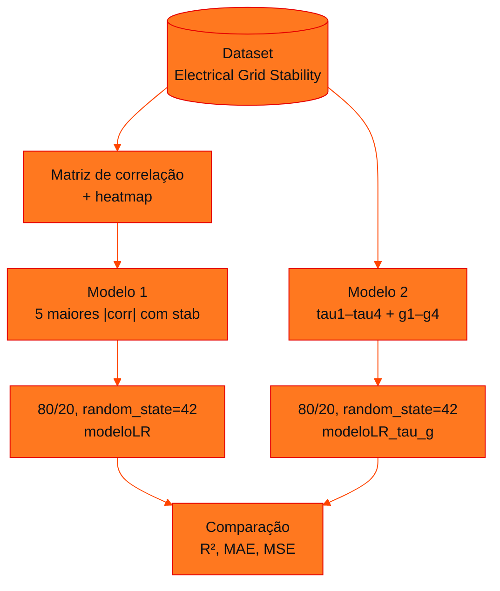

<!-- Documentação acadêmica da aula. Padrão visual: Knowledge Atelier (github.com/RenanMano). -->
<p align="center">
  
</p>
<p align="center">
  
</p>
<p align="center"><a href="#visao-geral">Visão geral</a> &nbsp;·&nbsp; <a href="#fundamentacao-teorica">Teoria</a> &nbsp;·&nbsp; <a href="#exemplos-praticos">Exemplos</a> &nbsp;·&nbsp; <a href="#exercicios-resolvidos">Exercícios</a> &nbsp;·&nbsp; <a href="#aplicacoes">Mercado</a> &nbsp;·&nbsp; <a href="#resumo">Resumo</a> &nbsp;·&nbsp; <a href="#questoes">Questões</a> &nbsp;·&nbsp; <a href="#referencias">Referências</a></p>
<p align="center">
  
  
  
  
  
  
</p>
<p align="center">
  
</p>
<br />

<h2 id="identificacao">Identificação da aula</h2>

| Item | Descrição |
| :--- | :--- |
| Disciplina | [Soluções em Energias Renováveis e Sustentáveis](../README.md) |
| Aula | 10 — 21/09/2026 |
| Título | Checkpoint 2 (Parte 2): Regressão Linear com Dados de Energia |
| Tema central | Roteiro da Parte 2 do Checkpoint 2: prever o valor numérico de stab com regressão linear, análise inicial do dataset, matriz de correlação, seleção das cinco variáveis de maior correlação absoluta (com apoio do Gemini), comparação com o modelo de todas as variáveis tau e g, e avaliação comparativa por R², MAE e MSE. |
| Tecnologias e ferramentas | Python 3, pandas, NumPy, scikit-learn, Matplotlib, Seaborn, Google Colab (Gemini) |
| Natureza do conteúdo | Roteiro de atividade (notebook em andamento) |

### Materiais da pasta

| Arquivo | Conteúdo |
| :--- | :--- |
| [`AULA_07_Regressão_Linear_com_Dados_de_Energia.ipynb`](AULA_07_Regress%C3%A3o_Linear_com_Dados_de_Energia.ipynb) | Roteiro “Checkpoint 2 – Regressão Linear e Estabilidade da Rede Elétrica”: bibliotecas, análise inicial, target stab, matriz de correlação, prompt para o Gemini, Modelo 1 (cinco maiores correlações), Modelo 2 (tau e g), métricas, tabela e gráficos comparativos, perguntas de análise e checklist de entrega; parcialmente preenchido. |

> [!NOTE]
> **Limitações da documentação.** O notebook é o roteiro da atividade parcialmente preenchido: a maioria das células de código está vazia ou incompleta, e algumas saídas salvas não correspondem ao código atual (detalhes abaixo). Ele não foi alterado. A solução proposta para estudo foi executada com o dataset da aula 09, usando NumPy para a regressão por mínimos quadrados (resultado idêntico ao LinearRegression do scikit-learn, que não está instalado no ambiente desta documentação) e reproduzindo a divisão de train_test_split(test_size=0.2, random_state=42). Essa reprodução da divisão foi conferida contra as saídas do notebook da aula 09.

<br />

<h2 id="visao-geral">Visão geral</h2>

Na [Parte 1](../aula09-14-09-26/README.md), o alvo era a **classe** (`stabf`). Agora é o **valor numérico** `stab`, um problema de **regressão**. A atividade compara dois modelos de regressão linear treinados sobre os mesmos registros:

- **Modelo 1:** as cinco variáveis com maior correlação absoluta com `stab`;
- **Modelo 2:** todas as variáveis cujos nomes começam com `tau` ou `g`.



*Figura 1 — O roteiro da atividade.*

<br />

<h2 id="objetivos">Objetivos de aprendizagem</h2>

- Selecionar variáveis por correlação, considerando também correlações negativas.
- Treinar e avaliar modelos de regressão linear.
- Interpretar R², MAE e MSE de forma **comparativa**.
- Usar um assistente de IA (Gemini) para gerar código, revisando-o antes de executar.

<br />

<h2 id="pre-requisitos">Pré-requisitos</h2>

- [Aula 09](../aula09-14-09-26/README.md): o dataset e a divisão treino/teste.
- Correlação e regressão linear; ver [Modelagem Linear, aula 15](../../modelagem-linear-para-aprendizado-de-maquina/aula15-28-09-26/README.md).

<br />

<h2 id="fundamentacao-teorica">Fundamentação teórica</h2>

### 1. Métricas de regressão (como o roteiro define)

| Métrica | Fórmula | Melhor quando |
| :--- | :--- | :--- |
| **R²** | $1 - \dfrac{\sum (y_i - \hat{y}_i)^2}{\sum (y_i - \bar{y})^2}$ | **Maior**: explica mais da variação de `stab` |
| **MAE** | $\frac{1}{n}\sum \lvert y_i - \hat{y}_i\rvert$ | **Menor**: menor erro absoluto médio |
| **MSE** | $\frac{1}{n}\sum (y_i - \hat{y}_i)^2$ | **Menor**: penaliza mais os erros grandes |

O roteiro insiste: "Não interprete as métricas de forma isolada: compare os valores obtidos pelos dois modelos".

### 2. Mesmos dados de teste

Os dois modelos usam `test_size=0.2` e `random_state=42`. Como X e y têm as mesmas linhas, a divisão é **idêntica**, e as métricas comparam os modelos sobre os **mesmos registros de teste**. O roteiro pede que se confirme isso comparando os índices de `y_teste` e `y2_teste`.

### 3. Estado do notebook da pasta

O notebook é o roteiro **parcialmente preenchido** e não foi alterado. Observações da leitura:

| Célula | Observação |
| :--- | :--- |
| Importações | Importa `LogisticRegression`, mas a atividade pede **regressão linear** (`LinearRegression`) |
| Carregamento | Usa o nome `dados`, enquanto o roteiro fala em `df` |
| Remoção de `stabf` | O código remove `stabf`, mas a **saída salva** mostra `stabf` presente e `stab` ausente. A saída é de uma execução anterior, com outro código |
| Matriz de correlação | A saída salva **não tem a coluna `stab`**, o que é coerente com essa execução anterior, mas impede a seleção das variáveis |
| `X = dados[{}]` | Incompleto: geraria erro ao executar |
| Células seguintes | Vazias: treino, métricas, comparação e respostas a preencher |

Para concluir a atividade, convém **reiniciar o ambiente e executar tudo em ordem**, como pede o *checklist* do próprio roteiro ("todas as células executadas e sem erros").

<br />

<h2 id="exemplos-praticos">Exemplos práticos</h2>

### Exemplo básico — R², MAE e MSE à mão

```python
# R², MAE e MSE calculados à mão para um conjunto pequeno de previsões de stab
real = [0.055, -0.006, 0.003, 0.029, 0.050]
prev = [0.040, 0.004, 0.010, 0.020, 0.035]

n = len(real)
erros = [r - p for r, p in zip(real, prev)]
mae = sum(abs(e) for e in erros) / n
mse = sum(e ** 2 for e in erros) / n
media = sum(real) / n
r2 = 1 - sum(e ** 2 for e in erros) / sum((r - media) ** 2 for r in real)
print(f"MAE = {mae:.4f}")
print(f"MSE = {mse:.6f}")
print(f"R²  = {r2:.4f}")
```

Saída esperada:

```text
MAE = 0.0112
MSE = 0.000136
R²  = 0.7717
```

O MSE fica muito menor que o MAE porque os erros são menores que 1, e elevá-los ao quadrado os reduz. Em escala pequena como a de `stab`, compare o MSE **entre modelos**, e não com o MAE.

### Exemplo aplicado — os dois modelos com os dados reais (solução proposta para estudo)

Executado na pasta da [aula 09](../aula09-14-09-26/README.md), onde está o CSV:

<!-- norun -->
```python
import numpy as np
import pandas as pd

df = pd.read_csv("Data_for_UCI_named.csv")
y = df["stab"]

# Modelo 1: as cinco maiores correlações absolutas com stab
corr = df.corr(numeric_only=True)["stab"].drop("stab")
top5 = corr.abs().sort_values(ascending=False).index[:5].tolist()
# Modelo 2: todas as colunas que começam com tau ou g
tau_g = [c for c in df.columns if c.startswith(("tau", "g"))]

# Mesma divisão de train_test_split(test_size=0.2, random_state=42)
perm = np.random.RandomState(42).permutation(len(df))
teste, treino = perm[:2000], perm[2000:]

def avaliar(colunas):
    X = np.column_stack([np.ones(len(df)), df[colunas].to_numpy()])   # intercepto + variáveis
    beta, *_ = np.linalg.lstsq(X[treino], y.to_numpy()[treino], rcond=None)
    real, prev = y.to_numpy()[teste], X[teste] @ beta
    mse = np.mean((real - prev) ** 2)
    mae = np.mean(np.abs(real - prev))
    r2 = 1 - np.sum((real - prev) ** 2) / np.sum((real - real.mean()) ** 2)
    return r2, mae, mse

print("Top 5:", top5)
print("tau/g:", tau_g)
linhas = [("Modelo 1", *avaliar(top5)), ("Modelo 2", *avaliar(tau_g))]
print(pd.DataFrame(linhas, columns=["Modelo", "R²", "MAE", "MSE"]).round(6).to_string(index=False))
```

Saída obtida:

<!-- norun -->
```text
Top 5: ['g3', 'g2', 'tau2', 'g1', 'tau3']
tau/g: ['tau1', 'tau2', 'tau3', 'tau4', 'g1', 'g2', 'g3', 'g4']
  Modelo       R²      MAE      MSE
Modelo 1 0.401770 0.023310 0.000811
Modelo 2 0.645229 0.017553 0.000481
```

<br />

<h2 id="exercicios-resolvidos">Exercícios e resoluções comentadas</h2>

As perguntas de análise do roteiro, respondidas com base na execução acima. É uma **solução proposta para estudo**; o material não traz gabarito.

<details>
<summary><strong>Solução proposta para estudo</strong></summary>

**Variáveis selecionadas (Modelo 1):**

| Posição | Variável | Correlação com `stab` |
| ---: | :--- | ---: |
| 1 | g3 | 0,3082 |
| 2 | g2 | 0,2936 |
| 3 | tau2 | 0,2910 |
| 4 | g1 | 0,2828 |
| 5 | tau3 | 0,2807 |

Todas as correlações são **positivas e moderadas**. As variáveis `p` quase não se correlacionam com `stab` (|r| < 0,03).

1. **Maior R²:** Modelo 2 (0,6452 × 0,4018).
2. **Menor MAE:** Modelo 2 (0,01755 × 0,02331).
3. **Menor MSE:** Modelo 2 (0,000481 × 0,000811).
4. **Mesmo vencedor nas três métricas?** Sim: o Modelo 2 é melhor em todas.
5. **O que mudou com tau e g?** O Modelo 1 deixou de fora `tau1`, `tau4` e `g4`, cujas correlações individuais (cerca de 0,28) são quase iguais às selecionadas. Incluí-las elevou o R² de 0,40 para 0,65. Correlações parecidas não justificam descartar variáveis, e cada uma traz informação **independente** (as correlações entre as variáveis `tau` e `g` são próximas de zero).
6. **Escolha:** o Modelo 2, por ter maior R² e menores MAE e MSE. Mesmo assim, R² = 0,65 indica que a relação não é totalmente linear. Modelos não lineares poderiam ser explorados nas próximas partes.

</details>

<br />

<h2 id="aplicacoes">Aplicações no mercado de trabalho</h2>

- **Previsão contínua em energia:** carga, geração solar e eólica e preços são problemas de regressão.
- **Seleção de variáveis:** escolher entradas por critério (correlação, domínio) e validar com métricas é rotina em ciência de dados.
- **IA como copiloto:** usar o Gemini, ou outro assistente, para gerar código e **revisá-lo** antes de executar é prática crescente, e a própria atividade a exige.

<br />

<h2 id="boas-praticas">Boas práticas e erros comuns</h2>

| Problemático | Recomendado | Motivo |
| :--- | :--- | :--- |
| Selecionar pela correlação com sinal | Usar o valor absoluto | Correlações negativas fortes também importam |
| Incluir `stab` (ou `stabf`) em X | Removê-las das variáveis preditoras | Vazamento de dados |
| Executar células fora de ordem | Reiniciar e executar tudo | Saídas coerentes com o código |
| Confiar no código gerado por IA sem revisar | Ler, testar e ajustar | O roteiro pede revisão antes de executar |
| Comparar métricas com divisões diferentes | Mesma proporção e `random_state` | Comparação justa |

<br />

<h2 id="resumo">Resumo para revisão</h2>

- Alvo numérico `stab` → regressão linear; métricas R² (↑), MAE (↓) e MSE (↓).
- Modelo 1: g3, g2, tau2, g1, tau3; Modelo 2: tau1–tau4 + g1–g4.
- Na execução desta documentação, o Modelo 2 venceu nas três métricas (R² 0,65 × 0,40).
- O notebook da pasta está incompleto e tem saídas de uma execução anterior.

<br />

<h2 id="questoes">Questões de fixação</h2>

1. Por que usar o valor absoluto da correlação na seleção?
2. Por que manter o mesmo `random_state` nos dois modelos?
3. Um modelo tem R² maior e MSE maior que outro, avaliados no mesmo teste. Isso é possível?

<details>
<summary><strong>Respostas comentadas</strong></summary>

1. Porque uma correlação de −0,8 indica relação linear tão forte quanto +0,8; só a direção muda.
2. Para que ambos sejam avaliados nos mesmos registros de teste e a diferença reflita os modelos, e não a amostra.
3. Não, no mesmo conjunto de teste: R² = 1 − SSE/SST, e SST é igual para os dois; logo, R² maior implica SSE e MSE menores.

</details>

<br />

<h2 id="referencias">Referências e materiais complementares</h2>

- [Electrical Grid Stability Simulated Data — UCI](https://archive.ics.uci.edu/dataset/471/electrical+grid+stability+simulated+data)
- [scikit-learn — `LinearRegression`](https://scikit-learn.org/stable/modules/generated/sklearn.linear_model.LinearRegression.html) · [métricas de regressão](https://scikit-learn.org/stable/modules/model_evaluation.html#regression-metrics)
- Material da pasta: [notebook](AULA_07_Regress%C3%A3o_Linear_com_Dados_de_Energia.ipynb)

<br />

<p align="center"><a href="../aula09-14-09-26/README.md">← Aula anterior</a> &nbsp;·&nbsp; <a href="../README.md">Índice da disciplina</a></p>

<p align="center"></p>
